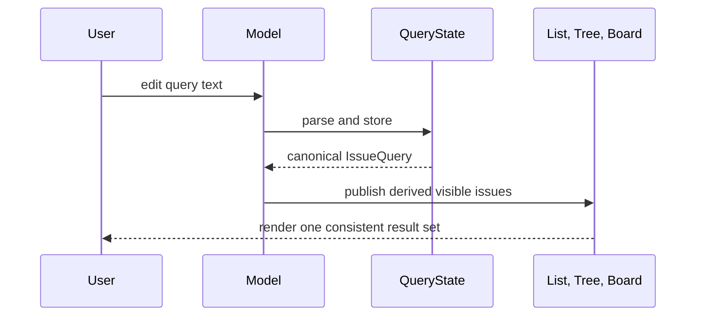

## Context

List, tree, and board views implemented search separately. List search used a fuzzy composite value, while tree and board searched literal title and ID substrings. Status, label, and assignee filters were also copied between the root model and individual views. The same input could therefore produce different result sets, and each new filter required synchronization code.

## Decision

**The root TUI model owns one query string and a finite `idle | editing` interaction state. It parses that string once through the canonical issue-query contract, then supplies derived result sets to list, tree, and board views.**

Plain text matches issue ID or title. Structured predicates support `id`, `title`, `status`, `priority`, `type`, `label`, `assignee`, and `project`. Positive values within one field use OR semantics; separate fields and negated predicates compose with AND.

## Options considered

- **One root-owned query state** (chosen): gives every view identical semantics and one write path, at the cost of migrating view-specific handlers.
- **Keep view-local search implementations**: smaller initial changes, but preserves drift and duplicated behavior.
- **Delegate all filtering to the data source**: reduces client work, but adds latency and makes behavior depend on backend capabilities.

## Consequences

New searchable fields and matching rules are implemented once. View models may retain local cursor and highlight positions because those are derived presentation state, but they do not own query text or matching semantics. Quick status and picker shortcuts must update the root query state or its canonical facet inputs. Re-evaluate this decision if result sets become too large for responsive in-memory evaluation.
