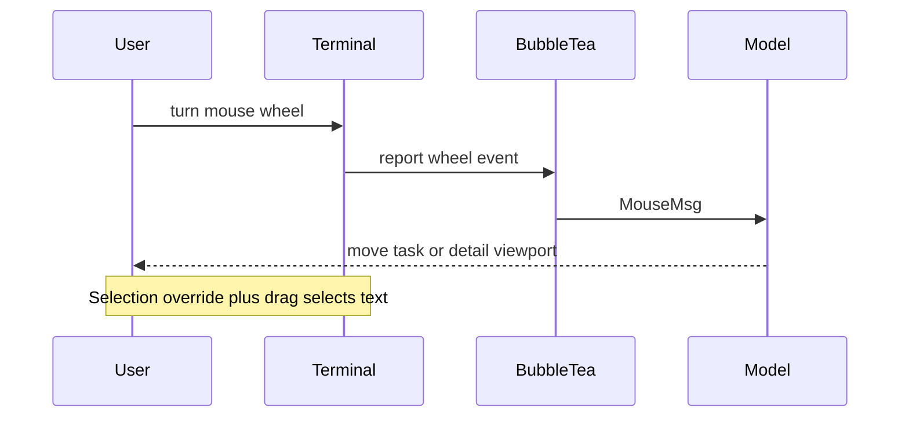

## Context

B9s runs in the terminal's alternate screen, but without mouse reporting the terminal interprets wheel input as a request to display scrollback. Tasks do not move even though the user is pointing at the TUI. An earlier mouse-capture implementation was removed because unmodified drag selection stopped working.

## Decision

**B9s enables Bubble Tea cell-motion reporting and maps wheel input to the focused task or detail view. Terminal text selection remains available through the terminal emulator's mouse-reporting override.**

## Options considered

- **Cell-motion reporting with the terminal selection override** (chosen): makes the wheel work throughout B9s and retains an explicit selection path, at the cost of requiring a modifier for selection.
- **Leave mouse reporting disabled**: preserves unmodified selection, but sends wheel input to terminal scrollback instead of the task list.
- **Enable all-motion reporting**: also supports hover, but captures movement B9s does not use and increases terminal input traffic.

## Consequences

Wheel events move the tree, board, and list selection or scroll the detail viewport according to focus. Mouse reporting is disabled automatically when B9s exits. Users select terminal text with their emulator's override while B9s is running (`Option` in iTerm2 and commonly `Shift` elsewhere). Re-evaluate this decision if supported terminals stop offering that override or B9s adds pointer interactions that require all-motion reporting.
