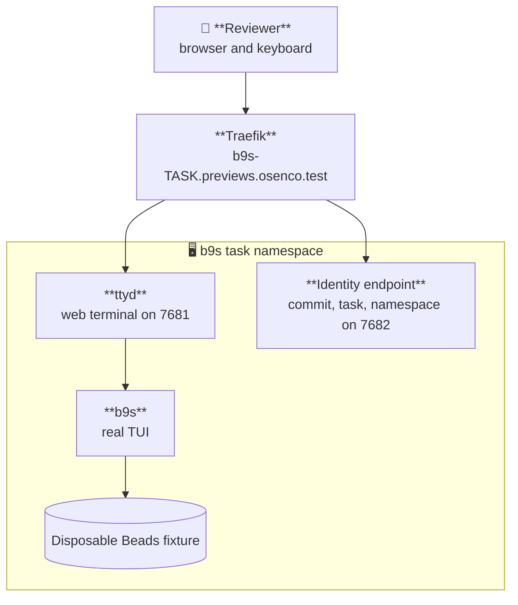

# Browser-accessible Kubernetes previews

The b9s preview runs the real terminal UI through ttyd. A reviewer opens one
URL, clicks the terminal, and uses the same keys as a local b9s session. The
preview uses disposable fixture data and never connects to a project tracker.

Status: active

## Interface

The deployment verifier uses five repository-owned commands:

```text
scripts/preview/preview-build   TASK_ID COMMIT_SHA
scripts/preview/preview-deploy  TASK_ID COMMIT_SHA
scripts/preview/preview-status  TASK_ID COMMIT_SHA
scripts/preview/preview-verify  TASK_ID COMMIT_SHA
scripts/preview/preview-destroy TASK_ID COMMIT_SHA
```

Every command requires a full lowercase commit SHA and refuses a different or
dirty worktree. The default kubeconfig is
`/mnt/secrets/preview/preview.kubeconfig`, the project-scoped b9s credential
issued by osenco-infra. The default context is `preview`.

## Runtime shape



The image bakes `/app/.commit-sha`. Deployment supplies only the task and
namespace, so an edited environment variable cannot make one image claim to be
another commit. `preview-verify` reads `/__preview` through the Service and
compares all three identity fields with the requested preview.

## Namespace and access boundary

`TASK_ID` becomes `b9s-TASK-SLUG`. The namespace carries these labels:

```text
omnigent.osenco.dev/preview=true
omnigent.osenco.dev/project=b9s
omnigent.osenco.dev/task-id=TASK_ID
omnigent.osenco.dev/commit-sha=COMMIT_SHA
```

The b9s deployer initially has only namespace lifecycle and constrained bind
permissions. The first namespaced object is a RoleBinding to
`omnigent-preview-workloads`. osenco-infra admission allows that binding only
inside a labelled `b9s-*` namespace. LimitRange, ResourceQuota and NetworkPolicy
ship with every preview.

The credential is project-scoped, not lane-scoped. One b9s lane can still reach
another b9s lane's preview. It cannot bind or deploy in a sibling project's
namespace or in `default`.

## Image delivery

Inside an Omnigent Runner Pod, `preview-build` uses the BuildKit service and
pushes the immutable SHA tag to the in-cluster registry:

```text
registry.registry.svc.cluster.local:5000/b9s-preview:COMMIT_SHA
```

On a workstation it uses Docker. Set `B9S_PREVIEW_PUSH_REGISTRY` when the
registry is reached through a local port-forward but the cluster must pull the
service-name image reference.

## Clickable URL

The local URL is:

```text
http://b9s-TASK-SLUG.previews.osenco.test:8081
```

The reserved `.test` suffix is answered locally by dnsmasq. Do not replace it
with nip.io or sslip.io. Labels ending in digits can be interpreted as part of
the embedded address and route to an unrelated public IP.

## Configuration

| Variable | Default | Purpose |
| --- | --- | --- |
| `B9S_PREVIEW_KUBECONFIG` | `/mnt/secrets/preview/preview.kubeconfig` | Project-scoped credential |
| `B9S_PREVIEW_CONTEXT` | `preview` | Explicit kubectl context |
| `B9S_PREVIEW_REGISTRY` | `registry.registry.svc.cluster.local:5000` | Image reference used by Kubernetes |
| `B9S_PREVIEW_PUSH_REGISTRY` | same as registry | Docker push endpoint |
| `B9S_PREVIEW_BUILDKIT_ADDR` | `tcp://buildkitd.buildkit.svc.cluster.local:1234` | Unprivileged in-cluster builder |
| `B9S_PREVIEW_HOST_SUFFIX` | `previews.osenco.test` | Browser hostname suffix |
| `B9S_PREVIEW_INGRESS_PORT` | `8081` | Local Traefik host port |
| `B9S_PREVIEW_ROLLOUT_TIMEOUT` | `180` | Bounded rollout wait in seconds |
| `B9S_PREVIEW_DELETE_TIMEOUT` | `180` | Bounded namespace deletion wait in seconds |

## Local verification

Use the admin kubeconfig only for operator testing. A lane uses the mounted b9s
kubeconfig instead.

```sh
sha="$(git rev-parse HEAD)"
export B9S_PREVIEW_KUBECONFIG="$HOME/.kube/config-local-mac-k3s"
export B9S_PREVIEW_CONTEXT=k3d-local-mac-k3s

scripts/preview/preview-build bd-b6jw "$sha"
scripts/preview/preview-deploy bd-b6jw "$sha"
scripts/preview/preview-verify bd-b6jw "$sha"
scripts/preview/preview-status bd-b6jw "$sha"
```

The contract guard is safe and does not call the cluster:

```sh
tests/preview_contract_test.sh
```

## Cleanup

`preview-destroy` derives exactly one namespace from the task ID, then checks
the project and task labels before deletion. It never uses a wildcard, label
selector, or `--all`.

```sh
scripts/preview/preview-destroy bd-b6jw "$sha"
```
